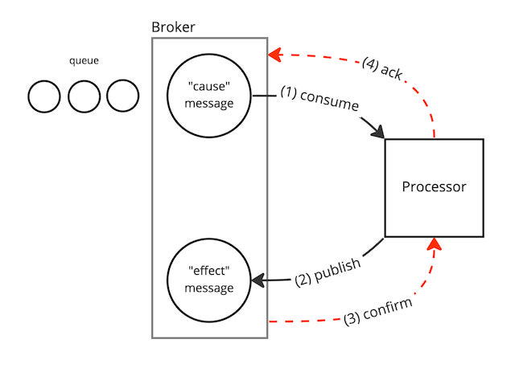

# Notes

## "At least once"

RabbitMQ delivers a message **before** it has been written to disk, therefore provides "at least
once" delivery guarantee. Considering that, system using communications over AMQP
must be idempotent.

## Cause-Effect Confirmation Lag

Let's consider a scenario where an application receives messages ("causes") from a queue, processes
them, and then publishes expected messages ("effects") to another queue. An example of this is a
Producer that consumes Requests and produces Replies. The rate at which messages are consumed is
limited by a "prefetch count", which is the maximum number of concurrent Requests that can be
processed at the same time.

For simplicity, let's assume that the prefetch count is set to 1. After a "cause" message is
consumed, the next message in the queue is held until the current message is acknowledged ("ack").
The current message is acknowledged once the Producer function is completed, which means that an
"effect" message has been successfully published using the ConfirmChannel. This "effect" message is
considered to be published when a confirmation is received from the broker.

In summary, the next "cause" message will be consumed from the queue only after the "effect" message
publication has been confirmed. Due to the ["at least once" effect](#-at-least-once-), *there is a
delay between the moment when a Reply **is delivered** to the Consumer and the moment when the
next Request is consumed from the Request queue*.

<a href="https://miro.com/app/board/uXjVOoy0ImU=/?moveToWidget=3458764545934661005&cot=14">
<picture>
<source media="(prefers-color-scheme: dark)" srcset="lag-dark.jpg">

</picture>
</a>

A lightweight Producer (one that produces responses quickly) can result in being "overloaded"
from the Consumer's perspective (that is, does not consume messages with an expected rate), even
though the Producer being idle while waiting for response publication confirmations.
